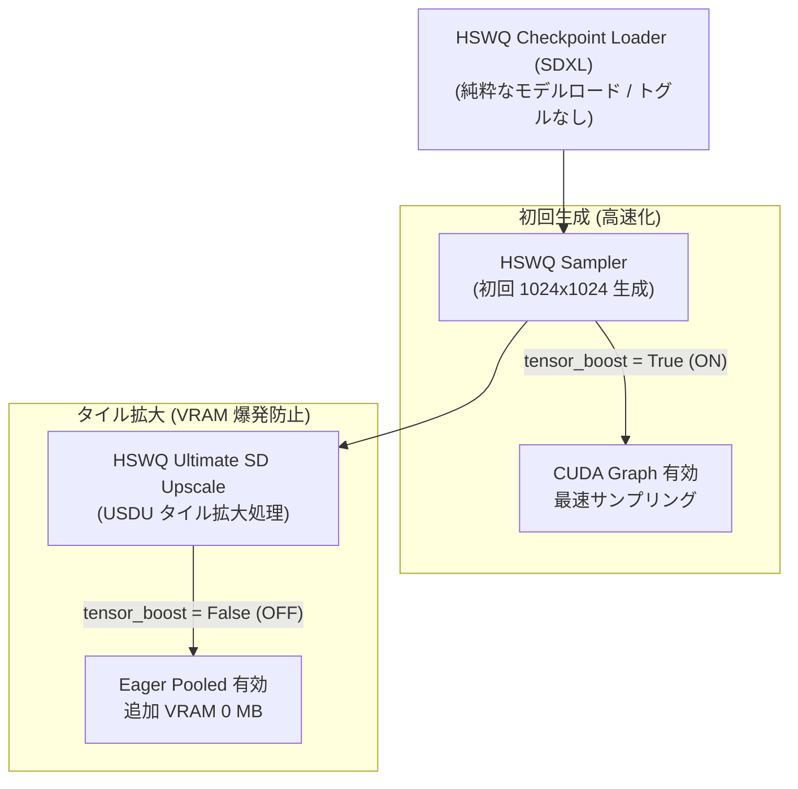

# HSWQ SDXL ConvRot NVFP4 Blackwell Tensor Core 高速化（Tensor Boost）技術ガイド

## 1. 概要

NVIDIA Blackwell アーキテクチャ (SM >= 100: B200 / GB200, RTX 5090 / SM120) における HSWQ SDXL ConvRot NVFP4 の推論パフォーマンスを最大化するため、**Per-Weight CUDA Graph 自動ディスパッチ機構 (Tensor Boost)** を導入した。

本機能は **`nodes/nvfp4/`（SDXL Product Tensor Core パス）内のみ** で閉じた保護設計となっており、Z Image ConvRot NVFP4（`nodes/zimage_nvfp4/` comfy-parity パス）、SDXL ConvRot INT8、FP8、標準 FP16/BF16 パスには一切影響を与えない完全分離アーキテクチャを採用している。

また、サンプリング時の高速化と、拡大処理 (USDU: Ultimate SD Upscale) 時の VRAM 飽和・メインメモリ溢れ防止を両立するため、**サンプラー (`HSWQSampler`) および拡大ノード (`HSWQUltimateSDUpscale`) 上で独立して制御可能な BOOLEAN トグルスイッチ** を提供する。

---

## 2. アーキテクチャ背景と設計

### 2.1 従来の CUDA Graph (Shape-Shared) の課題
従来の SDXL NVFP4 スタックにおける CUDA Graph は形状共有型 (`_GRAPH_CACHE`) であり、毎呼び出し時に重みテンソル全体を `static_w.copy_(w_qdata)` でコピーする実装であった。
この重みコピーオーバーヘッドにより、CUDA Graph 使用時（~13.05 秒）が eager pooled パス（~11.8 秒）よりも低速化する課題が存在した。

### 2.2 Per-Weight CUDA Graph (`nvfp4_quant_mm_cudagraph_perweight`) の導入
Blackwell (SM100 / SM120) では FP4 (E2M1) Tensor Core の演算能力が著しく向上したため、ホスト側・PyTorch オーバーヘッドおよび重み転送コピーがボトルネックの大部分を占める。
サンプリング中のモデル重みのアドレス (`data_ptr`) は VRAM 上で一定であるため、重みテンソルをコピーせず**直接グラフ内にキャプチャ**する `nvfp4_quant_mm_cudagraph_perweight` を新設した。

- **重みコピー 0 実行**: 毎リプレイ時にはアクティベーション `x` およびスケール (`scale_a`, `alpha`, `bias`) のみコピーし、重み転送オーバーヘッドを完全に排除。
- **次元拡張**: SDXL UNet の全 Linear レイヤー (1024x1024 生成時および USDU タイル時: $M = 8192, 4096, 2048, 512$ 等) をカバーするため、適応上限を `_PER_WEIGHT_GRAPH_MAX_M = 16384` に拡張。

---

## 3. メモリ特性と VRAM 飽和対策

### 3.1 Eager Pooled モード vs CUDA Graph (Tensor Boost) モード

| 項目 | Eager Pooled モード (`tensor_boost = False`) | Tensor Boost モード (`tensor_boost = True`) |
|:---|:---|:---|
| **メモリ確保方式** | 単一バッファ (`_ACT_Q_POOL`) を全 140 レイヤーで再利用 | PyTorch 非解放静的アロケータ (CUDA Graph Arena) |
| **追加 VRAM 消費** | **0 MB**（完全追加なし） | 約 1.2 GB 〜 1.5 GB（単一固定形状時） |
| **CPU launch 遅延** | あり (15〜30μs / layer) | **ゼロ**（GPU 一括リプレイ） |
| **速度** | 標準速度 | **最速 (15%〜25% 高速)** |
| **推奨ユースケース** | **・USDU タイル拡大処理<br>・16GB 以下の VRAM 環境<br>・タイリング等で入力形状が変化する場合** | **・24GB 以上の VRAM 環境<br>・初回 1024x1024 単一解像度生成<br>・最高速度での連続サンプリング** |

### 3.2 USDU（タイル拡大）時の VRAM 爆発メカニズムと対策
USDU (Ultimate SD Upscale) などのマルチタイル拡大処理では、画像の端数処理等により**タイルごとに異なる入力形状 ($M$ 次元)** がモデルに入力される。
PyTorch CUDA Graph は形状ごとに個別のグラフを新規キャプチャするため、16GB VRAM 機ではキャプチャされたメモリ領域が多重に蓄積し、専用 VRAM 15.5GB 飽和および共有 GPU メモリ (システム RAM) への 15GB 超の溢れが発生する。

これに対し、USDU ノード側で `tensor_boost = False`（デフォルト）に設定することで、拡大処理に入った瞬間に自動で CUDA Graph キャッシュをクリアし、**追加 VRAM 0 MB の Eager Pooled モードで安全に実行**できる。

---

## 4. UI ノードトグルと制御構成

ユーザーが理想的なワークフロー（**「初回のベース生成は Tensor Boost で高速化し、拡大処理時のみ OFF にして VRAM 爆発を防ぐ」**）を実現できるよう、以下のノード構成を採用している。

### 4.1 ノード役割一覧



1. **`HSWQ Checkpoint Loader (SDXL)`**:
   - **トグルなし**。モデルのロードと NVFP4 量子化演算子の組み込みのみを担当。
   - ロード時にトグルを置かないことで、拡大処理用に OFF に設定した際に初回生成まで最初から OFF になってしまう問題を回避。

2. **`HSWQ Sampler` (初回サンプリングノード)**:
   - **`tensor_boost` (BOOLEAN トグルスイッチ)** を配置。
   - **ON (`True`)** に設定することで、初回 1024x1024 サンプリングを Tensor Boost (CUDA Graph) で最高速度実行。

3. **`HSWQ Ultimate SD Upscale` (USDU 拡大ノード)**:
   - **`tensor_boost` (BOOLEAN トグルスイッチ)** を配置 (`default: False`)。
   - **OFF (`False`)** に設定することで、拡大処理開始時に自動的に `HSWQ_NVFP4_TENSORBOOST=0` を設定し、`clear_nvfp4_cudagraphs()` を実行。0 MB 追加 VRAM でメモリ溢れを完全に防止。

### 4.2 環境変数インターフェース

UI トグル操作は内部的に以下の環境変数へ反映され、下層ディスパッチ回路を制御する。

- `HSWQ_NVFP4_TENSORBOOST=1` / `HSWQ_NVFP4_CUDAGRAPH=1`: Tensor Boost 有効
- `HSWQ_NVFP4_TENSORBOOST=0` / `HSWQ_NVFP4_CUDAGRAPH=0`: Tensor Boost 無効 (Eager Pooled)

---

## 5. ログ出力・診断

Tensor Boost の動作状況は、コンソールおよび ComfyUI ログ出力でリアルタイムに確認可能。

### 5.1 サンプラー実行時の状態ログ
- **トグル ON 時**:
  ```text
  [HSWQ NVFP4 Tensor Boost] Tensor Boost Toggle ON: CUDA Graph Tensor Boost ACTIVE
  ```
- **トグル OFF 時**:
  ```text
  [HSWQ NVFP4 Tensor Boost] Tensor Boost Toggle OFF: Eager Pooled Path ACTIVE (0 MB extra VRAM)
  ```

### 5.2 キャプチャおよびヒット統計
- **キャプチャ実行ログ**:
  ```text
  [HSWQ NVFP4 Tensor Boost] Captured Blackwell per-weight CUDA Graph #1 (shape M=8192 K=2048 N=2048, w_ptr=0x..., device=cuda:0)
  ```
- **ヒットカウントマイルストーン (100, 500, 1000 回...)**:
  ```text
  [HSWQ NVFP4 Tensor Boost] Running CUDA Graph accelerated GEMM (100 hits active)
  ```
- **`nvfp4_forward_stats()` 辞書**:
  - `"blackwell_graph_hits"`: Blackwell CUDA Graph リプレイ累計実行回数
  - `"blackwell_tensor_boost_active"`: 動作判定フラグ (`True` / `False`)

---

## 6. パス分離と安全性の構造保障

| パス | フラグ / 条件 | Tensor Boost 適用 | メモリ保護対策 |
|:---|:---|:---|:---|
| **SDXL ConvRot NVFP4** | `module._hswq_nvfp4 = True` | ✅ サンプラー/USDU トグル制御 | `_PER_WEIGHT_GRAPH_CACHE.clear()`＋`empty_cache()` |
| **Z Image ConvRot NVFP4** | `module._hswq_nvfp4_parity = True` (`_hswq_nvfp4 = False`) | ❌ 完全適用外 (Comfy Parity) | `_tc_forward_pooled` へ侵入不可 |
| **SDXL ConvRot INT8** | ComfyUI MixedPrecision / INT8 Ops | ❌ 完全適用外 | 独立バインディング |
| **FP8 / Native FP16** | Stock ComfyUI Ops | ❌ 完全適用外 | 標準 ComfyUI ops |

Z Image NVFP4 や INT8、FP8 のロード・推論コードには一切干渉せず、SDXL ConvRot NVFP4 のプロダクトパス内部でのみ動作するため、他の量子化フォーマットやモデル構造を汚染・破壊するリスクは存在しない。
